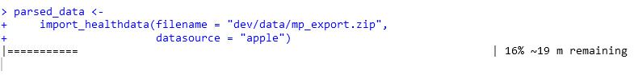
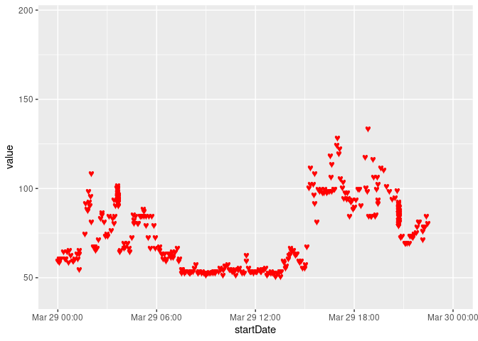
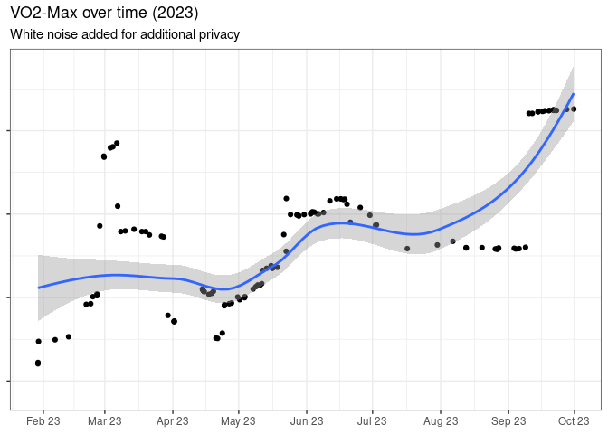
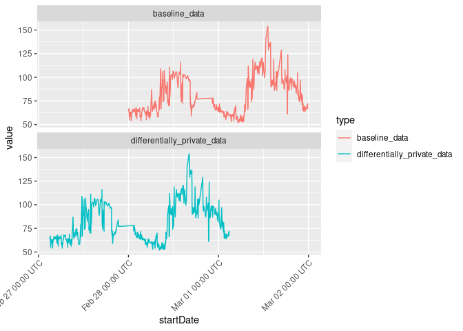
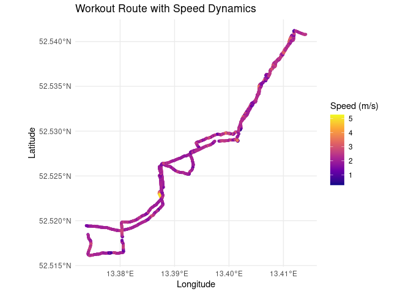
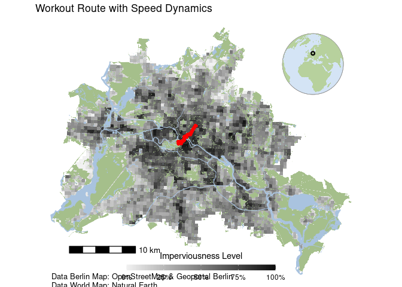

<!-- README.md is generated from README.Rmd. Please edit that file -->

# health2R 

This ReadMe contains an overview of the most important functions of the
`health2R` package. A full documentation for each of the respective
functions can be found in the function vignettes:

-   Import Apple Health Data: `vignette("01_import_apple_data")`
-   Analyse Health Data: `vignette("02_analyse_health_data")`
-   Add Differential Privacy: `vignette("03_differential_privacy")`
-   Analyse Workout Data: `vignette("04_analyse_workout_data")`

## Installation

The package can be installed from Github:

``` r
githubinstall::install_github("marianapatino/health2R")
```

## Importing Data

Apple Health data is stored in very large xml files which can be
exported as a zip file, but have tens of millions of rows (e.g. for many
data types, health data is logged and stored at the second level).
Therefore, the `import_healthdata` and `import_workouts` functions take
an exported zip file as input and parse it into an R data format. Due to
the very large amount of rows, this can take up to several minutes, and
should therefore be done once per updated health file, which can
subsequently be stored as an `rds` or `csv` file.

### Importing Health Data

First, we import, parse and save the an example dataset of health data.
A dynamic progress bar tracks the progress of the parsing process.

``` r
library(health2R)

parsed_healthdata <- 
  import_healthdata(filename = "../dev/data/mp_export.zip",
                    datasource = "apple")
```



To get a first overview, we sample a random subset of 5 rows from the
parsed data frame:

``` r
parsed_healthdata %>% 
  sample_n(5)
#> # A tibble: 5 × 9
#>   type                 sourceName sourceVersion unit  device startDate          
#>   <chr>                <chr>      <chr>         <chr> <chr>  <dttm>             
#> 1 HKQuantityTypeIdent… Mariana ’… 9.1           count <<HKD… 2022-12-18 07:51:12
#> 2 HKQuantityTypeIdent… Mariana ’… 9.3.1         count <<HKD… 2023-05-05 23:23:32
#> 3 HKQuantityTypeIdent… Mariana ’… 10.0          coun… <<HKD… 2023-10-03 09:06:01
#> 4 HKQuantityTypeIdent… Mariana ’… 9.5.1         kcal  <<HKD… 2023-06-20 16:07:06
#> 5 HKQuantityTypeIdent… Mariana ’… 9.6.1         kcal  <<HKD… 2023-08-26 15:01:33
#> # ℹ 3 more variables: endDate <dttm>, creationDate <dttm>, value <chr>
```

After the parsing is complete, we store the parsed file as an ´rds´
file:

``` r
saveRDS(parsed_healthdata,
        "../dev/data/parsed_healthdata_mp.rds")
```

### Importing Workout Data

Similarly, the `import_workouts` function imports workouts as a list of
`gpx` data, where the name of the individual list entries is the route
name.

``` r
parsed_workouts <- 
  import_workouts(filename = "../dev/data/mp_export.zip",
                  datasource = "apple")

saveRDS(parsed_workouts,
        "../dev/data/parsed_apple_workouts_mp.rds")
```

``` r
parsed_workouts[1] %>%
  map(~ .x %>% head(5))
#> $`Route 2022-03-28 9:23pm`
#> # A tibble: 5 × 8
#>     lat   lon   ele time                 speed course  hAcc  vAcc
#>   <dbl> <dbl> <dbl> <dttm>               <dbl>  <dbl> <dbl> <dbl>
#> 1  10.5 -84.8  633. 2022-03-28 17:54:24 0.689    46.3  1.75  1.74
#> 2  10.5 -84.8  633. 2022-03-28 17:54:25 0.714    50.0  1.56  1.53
#> 3  10.5 -84.8  634. 2022-03-28 17:54:26 0.355    43.9  1.47  1.36
#> 4  10.5 -84.8  634. 2022-03-28 17:54:27 0.146    23.7  1.43  1.23
#> 5  10.5 -84.8  634. 2022-03-28 17:54:28 0.0933  354.   1.42  1.12
```

## Analyse Health Data

After having once parsed and saved the data as `rds` files, it can be
read and further analysed.

``` r
parsed_healthdata <- 
  readRDS(file.path("PATH_TO_RDS/parsed_healthdata_mp.rds"))

parsed_workouts <- 
  readRDS(file.path("PATH_TO_RDS/parsed_apple_workouts_mp.rds"))
```

### Analyse Heart Rate Data

The dedicated function for extracting and analysing cardiovascular data
is called `get_cardio` and takes as input an already parsed healthdata
object, or the raw zip file. Furthermore, the variable `var` allows the
user to pick which cardio-related variable should be extracted, and
currently takes as options `heartrate`, `resting`, `walkingAverage`,
`workout`, `variability`, and `recovery`.

``` r
hr_data <- get_cardio(health_db = parsed_healthdata, 
                          var = "heartrate")
hr_data %>% select(type,sourceName,unit,startDate,value) %>% head()
#> # A tibble: 6 × 5
#>   type                              sourceName   unit  startDate           value
#>   <chr>                             <chr>        <chr> <dttm>              <dbl>
#> 1 HKQuantityTypeIdentifierHeartRate Mariana ’s … coun… 2022-03-28 05:55:33  69.9
#> 2 HKQuantityTypeIdentifierHeartRate Mariana ’s … coun… 2022-03-28 05:56:57  68  
#> 3 HKQuantityTypeIdentifierHeartRate Mariana ’s … coun… 2022-03-28 05:53:48  70  
#> 4 HKQuantityTypeIdentifierHeartRate Mariana ’s … coun… 2022-03-28 05:58:41  66  
#> 5 HKQuantityTypeIdentifierHeartRate Mariana ’s … coun… 2022-03-28 06:05:40  60  
#> 6 HKQuantityTypeIdentifierHeartRate Mariana ’s … coun… 2022-03-28 06:10:28  61
```

``` r
library(ggplot2)

ggplot(hr_data, 
       aes(x = startDate, y = value)) + 
    geom_text(aes(label = "\u2665"), color = "red", size = 3) +
    scale_x_datetime(limits = c(as.POSIXct("2022-03-29 00:00:00"),
                                as.POSIXct("2022-03-29 23:59:59")))
```

<!-- -->

### Analyse VO2-Max

Furthermore, the `get_vo2max` function obtains and the VO2-Max
performance data, either for the full available time range (default), of
for a specific `start_date` and `end_date`.

``` r
vo2max_data <- get_vo2max(health_db = parsed_healthdata,
                          start_date = as_date("2023-01-01"), 
                          end_date = as_date("2023-11-01"))
```

We can now VO2-Max (with differential noise added for privacy reasons):

``` r
private_vo2 <- 
  vo2max_data %>% 
  mutate(value = value + rnorm(1,0,10)) 
```

Plot and smoothed trend overtime:

``` r
ggplot(private_vo2, 
       aes(x = startDate, 
           y = value)) + 
  geom_point() +
  scale_x_datetime(limits = c(as.POSIXct("2023-01-29 00:00:00"),
                                as.POSIXct("2023-10-01 00:00:00")),
                     date_breaks = "1 month",
                     date_labels = "%b %y") + 
  geom_smooth() + 
  theme_bw() + 
  theme(axis.text.y = element_blank()) + 
  labs(x = NULL, y = NULL,
       title = "VO2-Max over time (2023)",
       subtitle = "White noise added for additional privacy")
#> `geom_smooth()` using method = 'loess' and formula = 'y ~ x'
#> Warning: Removed 27 rows containing non-finite values (`stat_smooth()`).
#> Warning: Removed 27 rows containing missing values (`geom_point()`).
```

<!-- -->

### Analyse Menstrual Cycle

``` r
menstruation_cycle_data <- get_menstruation_cycle(health_db = parsed_healthdata)
```

Of course, female menstrual cycles are a sensitive piece of data, which
would not be appropriate to be exposed in this online documentation.
Instead of plotting someone’s actual cycle data, we therefore simulate
random data in a similar format as they would be exported by the
`get_menstruation_cycle` function of the package. For further details
and the source code of the `simulate_year_cycles` function, please refer
to the vignette at `vignette("02_analyse_health_data")`.

``` r
set.seed(12345) # for reproducibility

# Use the function to simulate cycles between two dates
start_date <- as.Date("2024-01-01")
end_date <- as.Date("2024-12-31")
simulated_menstrual_data <- simulate_year_cycles(start_date, end_date)
```

``` r
simulated_menstrual_data %>%
  mutate(Month = floor_date(Date, "month"), 
         Day = day(Date)) %>%  
  ggplot(aes(x = Day,  y = 1,fill = Menstruation)) + 
  geom_tile(color = "white") + # Use tiles
  scale_fill_manual(values = c("TRUE" = "red", "FALSE" = "grey")) + 
 facet_wrap(~Month, scales = "free_y", 
             labeller = labeller(Month = function(x) format(as.Date(as.character(x), "%Y-%m-%d"), "%b %Y"))) +  # Custom labels
  labs(fill = "Menstruation", x = "Day of the Month", y = "") + 
  theme(axis.text.y = element_blank(), 
        strip.text.y = element_text(angle = 0)) 
```

<!-- -->

## Adding Differential Privacy

Health data data can repesent quite sensitive pieces of information,
which in some cases should be avoided to be leaked in an inappropriate
context. To still be able to use one’s wearable data, the `health2R`
package provides a function called `add_differential_privacy`, which
takes a duration object as input for the variable
`max_differential_privacy_offset`, and subsequently makes a data frame
differentially private by adding random noise to all time stamps in the
data, while retaining the relationship *between* the respective time
data.

``` r
library(health2R)
library(tidyverse)
library(lubridate)
```

First we plot some example heart rate data:

``` r
parsed_healthdata <- read_rds("path/to/your/health_data.rds")
```

``` r
rhr_data <- get_cardio(health_db = parsed_healthdata, 
                          var = "heartrate",
                       start_date = as_date("2023-02-28"),
                       end_date = as_date("2023-03-02"))
rhr_data %>% 
  select(type,sourceName,unit,startDate,value) %>% 
  head(3)
#> # A tibble: 3 × 5
#>   type                              sourceName   unit  startDate           value
#>   <chr>                             <chr>        <chr> <dttm>              <dbl>
#> 1 HKQuantityTypeIdentifierHeartRate Mariana ’s … coun… 2023-02-28 00:00:07    64
#> 2 HKQuantityTypeIdentifierHeartRate Mariana ’s … coun… 2023-02-28 00:07:58    67
#> 3 HKQuantityTypeIdentifierHeartRate Mariana ’s … coun… 2023-02-28 00:04:57    66
```

And the differentially privat data, which has been privatized with a
random noise addition of up to 2 days. This duration object parameter
can also hold shorter periods as appropriate,
e.g. `duration(3600,"seconds")` or similar.

``` r
priv_data <- 
  rhr_data %>%
  select(type,sourceName,unit,startDate,value) %>% 
  add_differential_privacy(max_differential_privacy_offset = lubridate::duration(2,"days")) 

priv_data %>% head(3)
#> # A tibble: 3 × 5
#>   type                              sourceName   unit  startDate           value
#>   <chr>                             <chr>        <chr> <dttm>              <dbl>
#> 1 HKQuantityTypeIdentifierHeartRate Mariana ’s … coun… 2023-02-27 03:01:38    64
#> 2 HKQuantityTypeIdentifierHeartRate Mariana ’s … coun… 2023-02-27 03:09:29    67
#> 3 HKQuantityTypeIdentifierHeartRate Mariana ’s … coun… 2023-02-27 03:06:28    66
```

Plotting the two time series shows the successful addition of
obfuscating noise:

``` r
combined_data <- bind_rows(rhr_data %>% mutate(type = "baseline_data"), 
                       priv_data %>% mutate(type = "differentially_private_data"))

ggplot(combined_data,
       aes(x = startDate,
           y = value, 
           col = type)) + 
  geom_line() +
  facet_wrap(~type,nrow = 2) + 
  scale_x_datetime(date_breaks = "1 day",
                   date_labels = "%b %d %H:%M UTC")  + 
  theme(axis.text.x = element_text(angle = 45,vjust = 1,hjust = 1))
```

<!-- -->

## Plotting Workout Data

``` r
#devtools::install_github("EcoDynIZW/d6berlin")
library(d6berlin)
library(lubridate)
library(sf)
#> Linking to GEOS 3.8.0, GDAL 3.0.4, PROJ 6.3.1; sf_use_s2() is TRUE
```

We first load the list of all workouts which we previously parsed in
`vignette("01_import_apple_data")` and pick one specific workout:

``` r
parsed_workouts <- 
  readRDS(file.path("path/to/workouts/rds"))
```

``` r
workout_data <- parsed_workouts$`Route 2023-10-08 12:35pm`

sf_data <- workout_data %>%
    st_as_sf(coords = c("lon", "lat"), crs = 4326) %>%
    st_transform(crs = 3857) # Using Web Mercator for visualization
```

To not leak any specific protected location, such as one’s home, we use
the function `remove_start_end` which removes the first and last `x`
minutes of a workout:

``` r
sf_data_obscured <- remove_start_end(sf_data, minutes = 5)
```

We can then plot the workout and the respective velocity:

``` r
ggplot(data = sf_data_obscured) +
  geom_sf(aes(color = speed), size = 1, alpha = 0.7) + 
  scale_color_viridis_c(name = "Speed (m/s)", 
                        option = "C", 
                        limits = range(sf_data$speed, na.rm = TRUE)) +
  theme_minimal() +
  labs(title = "Workout Route with Speed Dynamics",
       x = "Longitude",
       y = "Latitude") +
  theme(legend.position = "right")
```

<!-- -->

To plot the workout against a real city map of Berlin, we use the
`d6berlin` package:

``` r
base_map <- base_map_imp(color_intensity = 1, resolution = 500, globe = TRUE)

# Combine the base map with your data
berlin_map <- 
  base_map +
  geom_sf(data = sf_data_obscured, aes(color = speed), col = "red",size = 1, alpha = 0.7) +
  labs(title = "Workout Route with Speed Dynamics")+
   guides(color = FALSE)

# Print the combined map
print(berlin_map)
```

<!-- -->
