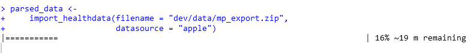

```{r, echo = FALSE}
knitr::opts_chunk$set(
  collapse = TRUE,
  comment = "#>",
  fig.path = "man/figures/"
)
```


```{r,message = F,warning = F,include = F}
library(health2R)
library(tidyverse)
set.seed(2903)
```

```{r,include = F}
base_path <- ".."
parsed_healthdata <- 
  readRDS(file.path(base_path,
                    "dev/data/parsed_healthdata_mp.rds"))

base_path <- ".."
parsed_workouts <- 
  readRDS(file.path(base_path,
                    "dev/data/parsed_apple_workouts_mp.rds"))
```


## Importing Data

Apple Health data is stored in very large xml files which can be exported as a zip file, but have tens of millions of rows (e.g. for many data types, health data is logged and stored at the second level). Therefore, the `import_healthdata` and `import_workouts` functions take an exported zip file as input and parse it into an R data format. Due to the very large amount of rows, this can take up to several minutes, and should therefore be done once per updated health file, which can subsequently be stored as an `rds` or `csv` file. 


### Importing Health Data

First, we import, parse and save the an example dataset of health data. A dynamic progress bar tracks the progress of the parsing process. 

```{r,eval = F}
library(health2R)

parsed_healthdata <- 
  import_healthdata(filename = "../dev/data/mp_export.zip",
                    datasource = "apple")
```


To get a first overview, we sample a random subset of 5 rows from the parsed data frame:

```{r}
parsed_healthdata %>% 
  sample_n(5)
```

After the parsing is complete, we store the parsed file as an ´rds´ file:

```{r,eval = F}
saveRDS(parsed_healthdata,
        "../dev/data/parsed_healthdata_mp.rds")
```


### Importing Workout Data

Similarly, the `import_workouts` function imports workouts as a list of `gpx` data, where the name of the individual list entries is the route name. 

```{r,eval = F}
parsed_workouts <- 
  import_workouts(filename = "../dev/data/mp_export.zip",
                  datasource = "apple")

saveRDS(parsed_workouts,
        "../dev/data/parsed_apple_workouts_mp.rds")
```

```{r}
parsed_workouts[1:2] %>%
  map(~ .x %>% head(5))
```


## Initial Exploration

After having once parsed and saved the data as `rds` files, it can be read and further analysed. 

```{r,eval = F}
parsed_healthdata <- 
  readRDS(file.path("PATH_TO_RDS/parsed_healthdata_mp.rds"))

parsed_workouts <- 
  readRDS(file.path("PATH_TO_RDS/parsed_apple_workouts_mp.rds"))
```

The full parsed file contains a large number of different variables and data types, e.g. just the 15 most frequent ones in our example data set:

```{r,eval = T}
parsed_healthdata$type %>% table() %>% sort(decreasing = TRUE) %>% head(15)
```

Specialized functions to pull and analyse certain specific variables and data types can be found in the `vignette("02_analyse_health_data")`


